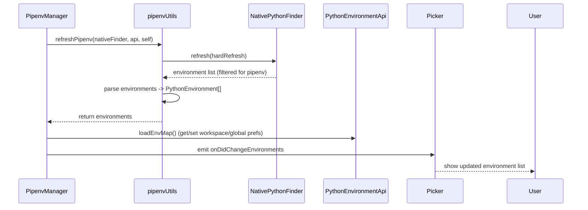

## Overview (high-level)

The pipenv manager provides discovery, enumeration, selection, and metadata for Python environments installed and managed by the `pipenv` tool. It plugs into the extension's environment manager abstraction so other parts of the extension (pickers, environment API consumers, telemetry) see a consistent view of pipenv-managed interpreters.

Primary files:

- `src/managers/pipenv/main.ts` — manager registration and lifecycle hook (registration with the manager registry).
- `src/managers/pipenv/pipenvManager.ts` — the manager implementation (class `PipenvManager`). Key methods to inspect:
  - `initialize()` — discovers environments at startup.
  - `getEnvironments(scope)` — returns cached environments; supports `all`, `global`, and per-URI lookup.
  - `refresh(context)` — re-runs discovery and emits environment change events.
  - `get(scope)` / `set(scope, environment)` — workspace/global selection helpers.
  - `resolve(context)` — attempt to resolve a pipenv path to a `PythonEnvironment` and add it to the collection.
  - `clearCache()` — clears persisted pipenv selections.
  - `loadEnvMap()` — internal mapping between project folders and resolved environments.
- `src/managers/pipenv/pipenvUtils.ts` — low-level helpers and command wrappers. Important exported functions and constants you should be aware of:
  - `refreshPipenv(...)` — performs the subprocess calls to `pipenv` and parses results.
  - `resolvePipenvPath(...)` — resolve a path supplied by user/workspace to a canonical interpreter `PythonEnvironment`.
  - `getPipenvForGlobal()`, `getPipenvForWorkspace()` / `setPipenvForWorkspace()` / `setPipenvForGlobal()` — persist and load user selections.
  - `clearPipenvCache()` — remove persisted selections.

Other integration points:
- `src/common/pickers/environments.ts` — where environment entries from managers are presented in the UI.
- `src/api.ts` and `src/extension.ts` — top-level APIs and registration that tie managers into the extension.

## Design goals

- Accurately discover pipenv environments and virtualenvs.
- Provide stable, human-friendly metadata for each environment (id, displayName, version, type, interpreter path).
- Cache results to avoid repeated heavy shell calls; run subprocesses asynchronously.
- Handle shell initialization nuances that affect `pipenv` (environment activation scripts).
- Work across macOS/Linux and Windows (including WSL) where possible.

## How discovery works (conceptual flow)

1. Manager availability check: verify `pipenv` is present (may require checking PATH and common installation locations).
2. Invoke low-level utils (e.g., `refreshPipenv`) which use the native Python finder to enumerate pipenv environments.
3. Parse environment output into `PythonEnvironment` objects that include interpreter path, group, and metadata.
4. Add to the manager collection and build maps from project folders to environments.
5. Expose results via the manager interface and emit change events when collection changes.

### Typical metadata produced for each environment
- envId.id — stable identifier (e.g., `pipenv:myproject` or `pipenv:myproject-env`).
- environmentPath — a `Uri` referencing the python executable.
- version — parsed version string (when available).
- displayName — friendly label shown in UI.
- group — `Pipenv` (used for grouping in pickers).

## Platform and Windows/WSL considerations

- macOS/Linux: `pipenv` is commonly installed via pip or package managers and typically available in PATH. The utils layer includes logic to locate pipenv and handle environment discovery.

- Windows: `pipenv` can be installed via pip, conda, or other package managers. For Windows users:
  - If the extension is running in a Windows host but the project is inside WSL or a remote environment, discovery should be performed in that environment (follow the same pattern used for other managers under remote/WSL scenarios).
  - If `pipenv` is installed inside WSL, ensure subprocess invocations happen in WSL context (the utilities may need to be extended to shell out via `wsl.exe` or use the remote extension plumbing).
  - When running on Windows without pipenv installed, mark pipenv as unavailable. The manager should gracefully no-op and not cause failures.

Be explicit in code when a path or command is intended for a remote/WSL environment; do not assume a single PATH behavior across platforms.

## Sequence diagram (high-level)

Here's a simple sequence diagram showing a typical discovery flow. This can be helpful when adding instrumentation or debugging:

## Integration & consumers

Who uses the manager and where to update when changing interfaces:

- UI pickers: `src/common/pickers/environments.ts` — verify how environment objects are consumed and displayed.
- Project-level selection: `src/managers/pipenv/pipenvManager.ts#set` and `loadEnvMap()` manage workspace/global mapping persisted via `pipenvUtils`.
- Environment resolution used when a folder/URI is provided: `pipenvManager.resolve()` delegates to `resolvePipenvPath()`.

When adding features that alter environment object shapes, update both the manager and the pickers/consumers that rely on those fields.

## Debugging & tracing

- Enable trace logs and capture subprocess invocation details (command, env, cwd) and raw stdout/stderr when troubleshooting discovery/parsing issues.
- Reproduce failing `pipenv` invocations in a terminal that matches the shell the extension uses (same login/non-login, same PATH and shell init files).
- When `pipenv` returns unexpected output, capture the exact stdout and stderr and compare against what `pipenvUtils` expects to parse.

## Important implementation notes & gotchas (concise)

- Environment discovery: `pipenv` environments are typically discovered through the native Python finder which can locate virtualenvs created by pipenv.
- Virtual environment paths: pipenv creates virtual environments in user-specific locations (varies by platform). The native finder handles locating these environments.
- Project association: pipenv environments are typically associated with specific project directories containing `Pipfile` or `Pipfile.lock` files.
- Activation commands: prefer using `pipenv shell` for activation when available, falling back to standard activation scripts.

## File & symbol references (quick jump list)

- Manager class and methods: `src/managers/pipenv/pipenvManager.ts` (class `PipenvManager`, methods listed earlier).
- Low-level utils and exported helpers: `src/managers/pipenv/pipenvUtils.ts` (look for `refreshPipenv`, `resolvePipenvPath`, `getPipenvForGlobal`, `getPipenvForWorkspace`, `clearPipenvCache`).
- Manager registration: `src/managers/pipenv/main.ts`.
- UI pickers: `src/common/pickers/environments.ts`, `src/common/pickers/managers.ts`.
- API surfaces: `src/api.ts`, `src/extension.ts`, and `src/common/*` interfaces used by managers.