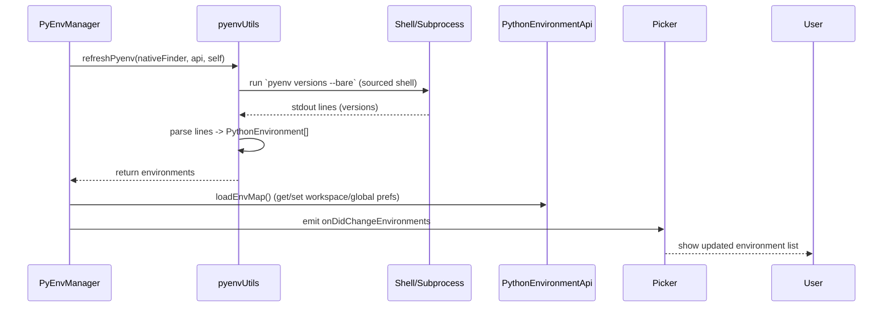

## Overview (high-level)

The pyenv manager provides discovery, enumeration, selection, and metadata for Python environments installed and managed by the `pyenv` tool. It plugs into the extension's environment manager abstraction so other parts of the extension (pickers, environment API consumers, telemetry) see a consistent view of pyenv-managed interpreters.

Primary files:

- `src/managers/pyenv/main.ts` — manager registration and lifecycle hook (registration with the manager registry).
- `src/managers/pyenv/pyenvManager.ts` — the manager implementation (class `PyEnvManager`). Key methods to inspect:
  - `initialize()` — discovers environments at startup.
  - `getEnvironments(scope)` — returns cached environments; supports `all`, `global`, and per-URI lookup.
  - `refresh(context)` — re-runs discovery and emits environment change events.
  - `get(scope)` / `set(scope, environment)` — workspace/global selection helpers.
  - `resolve(context)` — attempt to resolve a pyenv path to a `PythonEnvironment` and add it to the collection.
  - `clearCache()` — clears persisted pyenv selections.
  - `loadEnvMap()` — internal mapping between project folders and resolved environments.
- `src/managers/pyenv/pyenvUtils.ts` — low-level helpers and command wrappers. Important exported functions and constants you should be aware of:
  - `refreshPyenv(...)` — performs the subprocess calls to `pyenv` and parses results.
  - `resolvePyenvPath(...)` — resolve a path supplied by user/workspace to a canonical interpreter `PythonEnvironment`.
  - `getPyenvForGlobal()`, `getPyenvForWorkspace()` / `setPyenvForWorkspace()` / `setPyenvForGlobal()` — persist and load user selections.
  - `clearPyenvCache()` — remove persisted selections.
  - `PYENV_VERSIONS` — group identifier used on environment entries.

Other integration points:
- `src/common/pickers/environments.ts` — where environment entries from managers are presented in the UI.
- `src/api.ts` and `src/extension.ts` — top-level APIs and registration that tie managers into the extension.

## Design goals

- Accurately discover pyenv versions and virtualenvs.
- Provide stable, human-friendly metadata for each environment (id, displayName, version, type, interpreter path).
- Cache results to avoid repeated heavy shell calls; run subprocesses asynchronously.
- Handle shell initialization nuances that affect `pyenv` (shims and shell init scripts).
- Work across macOS/Linux and Windows (including WSL) where possible.

## How discovery works (conceptual flow)

1. Manager availability check: verify `pyenv` is present (may require sourcing the user's shell configuration).
2. Invoke low-level utils (e.g., `refreshPyenv`) which run `pyenv` commands to enumerate versions/virtualenvs.
3. Parse `pyenv` output into `PythonEnvironment` objects that include interpreter path, group, and metadata.
4. Add to the manager collection and build maps from project folders to environments.
5. Expose results via the manager interface and emit change events when collection changes.

### Typical metadata produced for each environment
- envId.id — stable identifier (e.g., `pyenv:3.8.10` or `pyenv:3.8.10:myenv`).
- environmentPath — a `Uri` referencing the python executable.
- version — parsed version string (when available).
- displayName — friendly label shown in UI.
- group — `PYENV_VERSIONS` (used for grouping in pickers).

## Platform and Windows/WSL considerations

- macOS/Linux: `pyenv` is commonly installed and initialized through shell startup files. The utils layer includes logic to run commands in a shell that sources the user's init files so pyenv shims resolve correctly.

- Windows: `pyenv` is not natively supported on Windows. Many Windows users run `pyenv` inside WSL. For these users:
  - If the extension is running in a Windows host but the project is inside WSL or a remote environment, discovery should be performed in that environment (follow the same pattern used for other managers under remote/WSL scenarios).
  - If `pyenv` is installed inside WSL, ensure subprocess invocations happen in WSL context (the utilities may need to be extended to shell out via `wsl.exe` or use the remote extension plumbing).
  - When running on Windows without WSL, mark pyenv as unavailable. The manager should gracefully no-op and not cause failures.

Be explicit in code when a path or command is intended for a remote/WSL environment; do not assume a single PATH behavior across platforms.

## Sequence diagram (high-level)

Here's a simple sequence diagram showing a typical discovery flow. This can be helpful when adding instrumentation or debugging:

## Integration & consumers

Who uses the manager and where to update when changing interfaces:

- UI pickers: `src/common/pickers/environments.ts` — verify how environment objects are consumed and displayed.
- Project-level selection: `src/managers/pyenv/pyenvManager.ts#set` and `loadEnvMap()` manage workspace/global mapping persisted via `pyenvUtils`.
- Environment resolution used when a folder/URI is provided: `pyenvManager.resolve()` delegates to `resolvePyenvPath()`.

When adding features that alter environment object shapes, update both the manager and the pickers/consumers that rely on those fields.

## Debugging & tracing

- Enable trace logs and capture subprocess invocation details (command, env, cwd) and raw stdout/stderr when troubleshooting discovery/parsing issues.
- Reproduce failing `pyenv` invocations in a terminal that matches the shell the extension uses (same login/non-login, same PATH and shell init files).
- When `pyenv` returns unexpected output, capture the exact stdout and stderr and compare against what `pyenvUtils` expects to parse.

## Important implementation notes & gotchas (concise)

- Shell initialization: `pyenv` often requires shell init scripts to be sourced. The utils layer accounts for this; don't remove that logic without verifying discovery still works for typical user setups.
- Shims vs real binaries: prefer resolving the real interpreter path rather than exposing the shim path to callers where feasible.
- Virtualenv names and aliases: keep the raw pyenv value in metadata; normalize only for display.
- Concurrency: avoid firing many simultaneous `pyenv` subprocesses — throttle or serialize as needed.

## File & symbol references (quick jump list)

- Manager class and methods: `src/managers/pyenv/pyenvManager.ts` (class `PyEnvManager`, methods listed earlier).
- Low-level utils and exported helpers: `src/managers/pyenv/pyenvUtils.ts` (look for `refreshPyenv`, `resolvePyenvPath`, `getPyenvForGlobal`, `getPyenvForWorkspace`, `clearPyenvCache`).
- Manager registration: `src/managers/pyenv/main.ts`.
- UI pickers: `src/common/pickers/environments.ts`, `src/common/pickers/managers.ts`.
- API surfaces: `src/api.ts`, `src/extension.ts`, and `src/common/*` interfaces used by managers.
